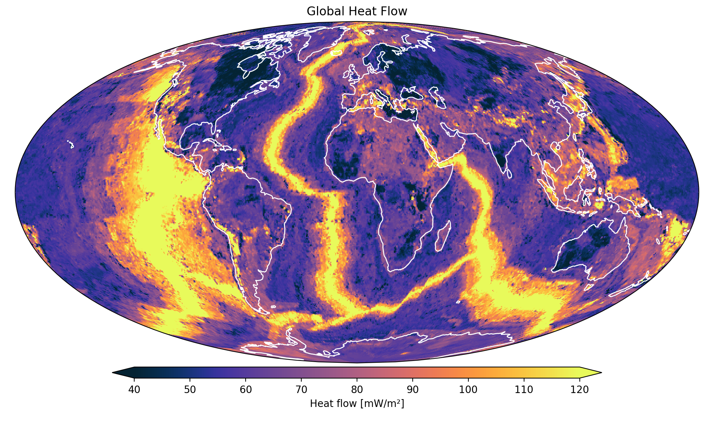
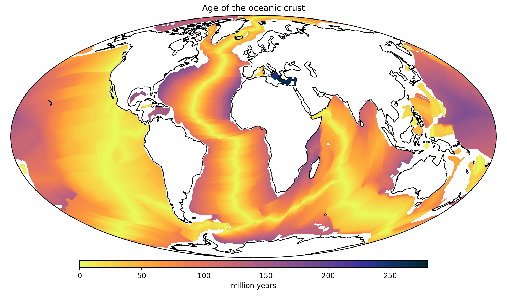
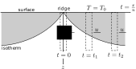
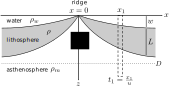

<!-- .slide: class="slide-title" data-background-color="#000000" data-background-image="../assets/background.svg" data-background-repeat="no-repeat" data-background-opacity="0.10" data-background-position="center" -->

ENVS398 Global Geophysics and Geodynamics

# Creation of the  oceanic lithosphere at  mid-ocean ridges

## Instructors: **[Leonardo Uieda](https://www.leouieda.com)** & **Andy Biggin**

<i class="fas fa-envelope fa-fw"></i> [Leonardo.Uieda@liverpool.ac.uk](mailto:Leonardo.Uieda@liverpool.ac.uk)
|
<i class="fab fa-twitter fa-fw"></i> [@leouieda](https://twitter.com/leouieda)
|
[<i class="fab fa-creative-commons"></i><i class="fab fa-creative-commons-by"></i> CC-BY 4.0 License](https://creativecommons.org/licenses/by/4.0/)

---

# Aims

Understand the main models for the formation of the oceanic lithosphere,
including:

* The physics behind them
* How they compare to observations
* Their implications for our understanding of ocean floor topography

---

# Mid-ocean ridges

Topography and bathymetry map of the Earth according to the
[ETOPO1](https://doi.org/10.7289/V5C8276M) digital elevation model.

Oceanic lithosphere is created at **mid-ocean ridges**

Ridges are **chains of shallow bathymetry** cutting across the world's oceans

---

# Mid-ocean ridges

Map of global earthquake hypocenters from the Global CMT Catalog
([Dziewonski et al., 1981](https://doi.org/10.1029/JB086iB04p02825);
[Ekström et al., 2012](https://doi.org/10.1016/j.pepi.2012.04.002))

Marked by concentrated seismicity at shallow depths

Indicator of movement and a key piece of evidence for sea floor spreading

---

# Mid-ocean ridges

Map of geothermal heat flow
[(Lucazeau, 2019)](https://doi.org/10.1029/2019GC008389) with elevated values at
mid-ocean ridges and lower values in cratonic regions.

Available data and models show that **ridges have elevated geothermal heat
flow**.

Important boundary condition for mantle convection

---

# Mid-ocean ridges

Map of the gravity disturbance from the EIGEN-6C4 spherical harmonic model
[(Foerste et al., 2014)](https://doi.org/10.5880/icgem.2015.1).
Small values indicate isostatic equilibrium.

Gravity disturbance data suggests that mid-ocean ridges are in
**isostatic equilibrium**

Ridges can't be compensated by thickened lithosphere since it's created
there

---

# Questions

* What is the thickness of the oceanic lithosphere?
* Does it vary with lithospheric age?
* Can models match observations of heat flow, age, and bathymetry?

---

Young lithosphere has higher heat flow than old lithosphere.
 
Can we **model** this cooling process?

Map of global geothermal heat flow
[(Lucazeau, 2019)](https://doi.org/10.1029/2019GC008389).

Map of the age of the oceanic crust and lithosphere
[(Müller et al., 2008)](https://doi.org/10.1029/2007GC001743)
showing good correlation with oceanic heat flow.

---

# Some assumptions for our modelling

1. Away from the ridge, the lithosphere **cools by vertical conduction**.
1. Spreading and cooling are **symmetric** around the ridge axis.
1. As it cools it becomes **denser** and the sea-floor depth increases.
1. Ultimately, this process **initiates subduction** (driving convective flow).

---

# Half-space cooling model

Sketch of the half-space cooling model as a 2D problem (temperature $T$ as a
function of position $x$ and $z$). The ridge is at $x=0$ and spreading happens
at a uniform velocity $u = \frac{x}{t}$ in both directions.

Lithosphere-asthenosphere boundary (LAB) is defined by an **isotherm**

Model starts with asthenosphere temperature $T = T_a$ at the ridge

Temperature at the surface is held at $T_0$.

Cooling by **vertical conduction only** (into the water column) as plate
moves away from ridge

No internal heat generation

---

# Switching from $x$ to $t$

Sketch of the half-space cooling model as a 1D problem (temperature $T$ as a
function of depth $z$ and time $t$). Think of each position away from the ridge
as a **snapshop in time** of a 1D problem since the spreading rate $u$ is
constant and conduction only happens vertically.

Spreading rate $u$ ties distance from the ridge $x$ and time: $t = \frac{x}{u}$

Switch from 2D in space to the simpler problem of 1D (vertical) varying with
time

Described by the 1D diffusion equation:

$
\dfrac{\partial^2 T}{\partial z^2}
= \dfrac{1}{\alpha} \dfrac{\partial T}{\partial t}
$

$\alpha$ is the
<a href="https://en.wikipedia.org/wiki/Thermal_diffusivity">thermal
diffusivity</a>\*

\* The Geodynamics book uses $\kappa$ for thermal diffusivity.

---

# Boundary conditions

A 1D partial differential equation (PDE) with time will require:

**Initial condition:** Profile is at asthenosphere temperature $T=T_a$ at the
ridge (or $t=0$)

**Boundary condition:** The top of the lithosphere $z=0$ is at a constant
temperature $T = T_0$

---

Solving the diffusion equation and applying
 
the boundary and initial conditions

We get temperature as a function of time and depth:

$$
T(z, t) = T_0 + (T_a - T_0)\ \text{erf}
\left(
\dfrac{z}{2\sqrt{\alpha t}}
\right)
$$

$
\text{erf}(x) = \dfrac{2}{\sqrt{\pi}} \int\limits_0^x e^{-n^2} dn
$
is the [error function](https://en.wikipedia.org/wiki/Error_function), which
we can easily calculate numerically using Python or Matlab.

See "Geodynamics" sections 4.15 and 4.16 for a derivation.

---

# Example

Calculate $T(z, t)$ for a range of times and depths assuming:

* $T_0 = 273\ K$
* $T_a = 1300\ K$
* $\alpha = 1\ mm^2/s$

---

# Comparing with observations

Now that we have a model, we can compare **observations** to values predicted
by the model.

We can't measure temperature up to depths of 100s of km.

So we need to use our model to predict other observables, like **heat flow** at
the surface and **bathymetry**.

---

# Heat flow

Like much of geophysics, this map is actually an interpolation of several
scattered data sources
[(Lucazeau, 2019)](https://doi.org/10.1029/2019GC008389).

Can be measured in ocean bottom drilling operations (expensive)

Difficult to remove effects of hydrothermal convection in younger lithosphere

Data compilations exist that try to control for these effects

---

# Heat flow for half-space cooling

From [Fourier's law](https://en.wikipedia.org/wiki/Thermal_conduction#Fourier's_law),
heat flow is:
$\ q(z) = -k \dfrac{\partial T}{\partial z}$

We want to calculate heat flow at the surface $q(z=0) = q_0$

Substituting $T$ from the half-space model\*:
$\ q_0(t) = k \dfrac{T_a - T_0}{\sqrt{\pi \alpha t}}$

Assuming we know $T_a$, $T_0$, $\alpha$, and $k$ we can calculate heat flow
 
as a function of lithospheric age

$k$ is the [thermal conductivity](https://en.wikipedia.org/wiki/Thermal_conductivity)
 
\*See "Geodynamics" section 4.15 for a derivation
(the sign here is flipped because most data have positive flow upward instead
of downward)

---

# Bathymetry

[ETOPO1](https://doi.org/10.7289/V5C8276M) is also the result of the
integration of several different data sources, including shipborne surveys and
satellite data.

Can be measured to high resolution from ships using
[singlebeam and multibeam echosounders](https://en.wikipedia.org/wiki/Multibeam_echosounder)
but at high cost and low spatial coverage

Or from space with
[satellite altimetry](https://en.wikipedia.org/wiki/Satellite_geodesy#Altimetry)
for lower resolution and global coverage

---

# Bathymetry for half-space cooling

We know from gravity disturbances that ridges are in isostatic equilibrium

At a compensation depth $D$ the mass of the column above any point $x$ must be
the same

At the ridge ($x = t = 0$), the total is the mass of asthenosphere plus the
water column with depth $w_r$

$$
\rho_w w_r + \rho_a (D - w_r)
$$

Assuming columns with unit area.

---

# Bathymetry for half-space cooling

At a distance $x$, the total is sum of the mass of the asthenosphere,
lithosphere, and water

Assuming that the density of the lithosphere varies with depth $z$:

$
\rho_w w + \rho_a (D - L - w) + \int\limits_{w}^{w + L}\rho(z) dz
$

---

# Bathymetry for half-space cooling

The density of the lithosphere will also depend on its **temperature**,
which we can calculate as a function of $x$ and $z$ from our model

Assuming density variations are due to thermal expansion:

$$
\rho(x, z) = \rho_a \left[1 - \alpha_V [T(x, z) - T_a]\right]
$$

$\alpha_V$ is the coefficient of thermal expansion

---

# Bathymetry for half-space cooling

Equating the total masses at the ridge and at $x$, substituting the density
from thermal expansion, integrating, and converting $x$ back to $t$ we get\*:

$$
w(t) = w_r + \dfrac{2 \rho_a \alpha_V (T_a - T_0)}{\rho_a - \rho_w}
\sqrt{\dfrac{\alpha t}{\pi}}
$$

\*See "The Solid Earth" section 7.5.2 for a derivation.

---

# Does it fit the data?

Now that we can predict two observable quantities (heat flow and bathymetry as
functions of lithospheric age), we can test the half-space cooling model.

In the associated **practical** activity, we will implement the corresponding
equations in Python and evaluate how well our model fits the available data.

---

# Reading

For an detailed discussion and derivation of equations,
 
refer to the excellent textbooks:

* "The Solid Earth" by C. M. R. Fowler (chapter 7 section 5)
* "Geodynamics" by D. Turcotte and G. Schubert (chapter 4 sections 15-17)

---

<!-- END MATTER -->
<!-- ====================================================================== -->

<!-- .slide: class="slide-license" -->

<i class="fab fa-creative-commons"></i><i class="fab fa-creative-commons-by"></i>

Unless otherwise noted,
the contents of this lecture are
licensed under the
 
[Creative Commons Attribution 4.0 International License](https://creativecommons.org/licenses/by/4.0/).

