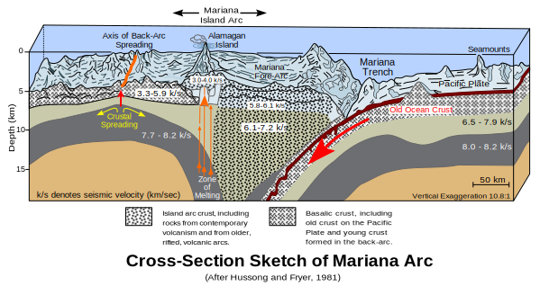
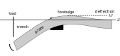
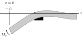

<!-- .slide: class="slide-title" data-background-color="#000000" data-background-image="../assets/background.svg" data-background-repeat="no-repeat" data-background-opacity="0.10" data-background-position="center" -->

ENVS398 Global Geophysics and Geodynamics

# Bending of the oceanic lithosphere at subduction zones

## Instructors: **[Leonardo Uieda](https://www.leouieda.com)** & **Andy Biggin**

<i class="fas fa-envelope fa-fw"></i> [Leonardo.Uieda@liverpool.ac.uk](mailto:Leonardo.Uieda@liverpool.ac.uk)
|
<i class="fab fa-twitter fa-fw"></i> [@leouieda](https://twitter.com/leouieda)
|
[<i class="fab fa-creative-commons"></i><i class="fab fa-creative-commons-by"></i> CC-BY 4.0 License](https://creativecommons.org/licenses/by/4.0/)

---

# Aims

Understand the processes associated with
 
subduction of the oceanic lithosphere:

* How we image slab geometry
* Flexure of the lithosphere in convergent margins
* How subduction appears in gravity, topography, and bathymetry

---

# Overview

Subduction is a big part of global tectonics

Possible driver of convection in the mantle

Important global cycles: water and carbon

Understanding subduction is key to understanding the deep Earth

Image credit:
[K. D. Schroeder](https://commons.wikimedia.org/wiki/File:Subduction-en.svg) (CC-BY-SA)

---

# Where is the slab?

The cold subducting slab heats and deforms causing deep earthquakes (70-300km)

This region is known as the Wadati-Benioff zone

The surrounding asthenosphere is ductile and cannot cause earthquakes

Hypocenters provide an image of the slab

Example: hypocenters along the Japan
subduction zone from the Global CMT Catalog
([Dziewonski et al., 1981](https://doi.org/10.1029/JB086iB04p02825);
[Ekström et al., 2012](https://doi.org/10.1016/j.pepi.2012.04.002))

This is still used to determine slab geometry,
for example the 2018 [Slab2](https://doi.org/10.1126/science.aat4723) model.

---

# At the surface

Profile of bathymetry across the Mariana Trench subduction.

Subducting plate bends under the load, creating trenches

Bending causes a forebulge next to the trench

Island arcs are often associated with the overlying plate

Examples: Japan, Philippines, Tonga, Solomon Islands

The Pacific plate is older (hence cooler and denser). How can we tell from
comparing the bathymetry the two plates?

---

# At the subsurface

Subduction brings water (in minerals) to the mantle

Hydration reduces the melting point of mantle rocks

Melt rises to the surface

Associated volcanism creates island arcs

Image credit:
[V. Ezekowitz](https://en.wikipedia.org/wiki/File:Cross_section_of_mariana_trench.svg)
(CC-BY-SA)

---

<!-- .slide: class="slide-transition" -->

# What physical model describes   bending during subduction?

Is it able to explain surface geophysical observations?

---

# Flexure of an elastic plate

$w$ = deflection,
$q$ = force density of the load,
$g$ = gravity,
$E$ = Young's modulus,
$\nu$ = Poisson's ratio,
$T_e$ = effective elastic thickness

**Note on notation:** $w$ is the deflection from the normal plate depth, **not** bathymetry.
Away from subduction zones, we expect $w = 0$.

1D flexure equation at equilibrium:

$ D\dfrac{\partial^4 w}{\partial x^4} = q - g (\rho_m - \rho_c) w $

$D$ is the flexural rigidity, which reflects the physical properties of the
plate:

$D = \dfrac{E T_e^2}{12(1 - \nu^2)}$

---

# Boundary conditions

Bending under an **end load**:

1. No flexure far away from the trench, $w \to 0$ as $x \to \infty$
1. Load of $-V_0$ is applied at $x = 0$
1. The *bending moment* at $x = 0$ is $M_0$

**Problem:** In reality $M_0$ and $V_0$ are unknown.

---

# Solution for the deflection

Write $w(x)$ in terms of measurable quantities:

* Forebulge deflection $w_b$ and peak position $x_b$
* Position $x_0$ where deflection crosses the zero line

$ w(x) = w_b\ e^{\pi/4} \sqrt{2}
\exp\left( -\dfrac{\pi}{4}\left(\dfrac{x - x_0}{x_b - x_0}\right) \right)
\sin\left(\dfrac{\pi}{4}\left(\dfrac{x - x_0}{x_b - x_0}\right) \right) $

See "Geodynamics" section 3.17 for a derivation.

---

# Gravity disturbances

gravity disturbance = observed gravity - normal (ellipsoid) gravity

This means that the density anomalies causing the observed disturbance are:

Real Earth densities - Normal Earth densities

Assume that the ellipsoid is layered (including an ocean)

Density anomalies at subduction zones 👉🏽

---

# Predicting gravity

Model of density anomalies due to subduction. Anomalies are real Earth density
minus normal Earth density.

Assumptions: density contrast between lithosphere-asthenosphere mantle is
negligible, the crust has constant thickness, bending at the surface is equal
to bending at the Moho.

Once again, we can model the gravitational attraction of the deflection with
the Bouguer plate approximation:

$ g_{w} = 2 \pi G \Delta\rho_{top} w + 2 \pi G \Delta\rho_{bottom} w $

$\Delta\rho_{top} = \rho_c - \rho_w$ if $w > 0$

$\Delta\rho_{top} = \rho_w - \rho_c$ if $w < 0$

$\Delta\rho_{bottom} = \rho_m - \rho_c$ if $w > 0$

$\Delta\rho_{bottom} = \rho_c - \rho_m$ if $w < 0$

---

# Does it fit the data?

We can now predict gravity disturbances and bathymetry caused by the deflection
of the lithosphere across subduction zones.

In the associated **practical** activity, we will implement the corresponding
equations in Python and evaluate how well our model fits the available data
along profiles.

---

# Reading

For an detailed discussion and derivation of equations,
 
refer to the excellent textbooks:

* "The Solid Earth" by C. M. R. Fowler, section 9.6
* "Geodynamics" by Donald Turcotte and Gerald Schubert, sections 3.17

---

<!-- END MATTER -->
<!-- ====================================================================== -->

<!-- .slide: class="slide-license" -->

<i class="fab fa-creative-commons"></i><i class="fab fa-creative-commons-by"></i>

Unless otherwise noted,
the contents of this lecture are
licensed under the
 
[Creative Commons Attribution 4.0 International License](https://creativecommons.org/licenses/by/4.0/).

