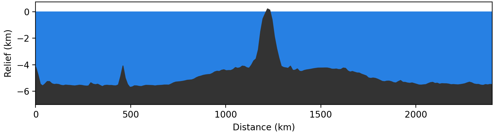
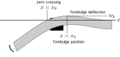
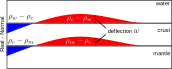

<!-- .slide: class="slide-title" data-background-color="#000000" data-background-image="../assets/background.svg" data-background-repeat="no-repeat" data-background-opacity="0.10" data-background-position="center" -->

ENVS398 Global Geophysics and Geodynamics

# Flexure of the oceanic lithosphere under seamounts

## Instructors: **[Leonardo Uieda](https://www.leouieda.com)** & **Andy Biggin**

<i class="fas fa-envelope fa-fw"></i> [Leonardo.Uieda@liverpool.ac.uk](mailto:Leonardo.Uieda@liverpool.ac.uk)
|
<i class="fab fa-twitter fa-fw"></i> [@leouieda](https://twitter.com/leouieda)
|
[<i class="fab fa-creative-commons"></i><i class="fab fa-creative-commons-by"></i> CC-BY 4.0 License](https://creativecommons.org/licenses/by/4.0/)

---

# Aims

Comprehend the models for flexure of the
 
oceanic lithosphere under the load of a seamount:

* The governing equation and it's solution by finite-differences
* How the flexure appears in gravity and bathymetry data

---

# Seamounts everywhere

Topography and bathymetry map of the Earth according to the
[ETOPO1](https://doi.org/10.7289/V5C8276M) digital elevation model.
Seamounts are small dots away from mid-ocean ridges.

The sea floor is not smooth away from mid-ocean ridges (as predicted by cooling
models)

It is full of seamounts (small active or extinct volcanoes) and oceanic islands

Current estimates are between 10,000-100,000 seamounts globally
([Wessel et al, 2015](https://doi.org/10.5670/oceanog.2010.60))

---

# Seamounts in gravity

Map of the gravity disturbance from the EIGEN-6C4 spherical harmonic model
[(Foerste et al., 2014)](https://doi.org/10.5880/icgem.2015.1).
Seamounts cause large gravity disturbance.

Prominent features in gravity disturbance data (look at the West Pacific)

Indicates that the seamounts and small oceanic islands are not supported by
isostatic equilibrium

Try plotting Bouguer disturbances vs smoothed bathymetry around a seamount
chain to verify this

---

# Example: Hawai'i

Bathymetry profile across the island of Oahu in the Hawai'i.
The sea floor is bent downwards next to the island and then upwards before
settling at the normal depth of 6 km.
 
**Recognize this pattern?**

---

<!-- .slide: class="slide-transition" -->

# What mechanism supports seamounts and oceanic islands?

---

# Flexure of an elastic plate

$w$ = deflection,
$q(x)$ = force density of the load,
$g$ = gravity,
$E$ = Young's modulus,
$\nu$ = Poisson's ratio,
$T_e$ = effective elastic thickness,
$\rho_m$ = mantle density,
$\rho_w$ = water density

**Note on notation:** $w$ is the deflection from the normal plate depth,
**not** bathymetry.

1D flexure equation at equilibrium:

$ D\dfrac{\partial^4 w}{\partial x^4} = q - g (\rho_m - \rho_w) w $

$D$ is the flexural rigidity, which reflects the physical properties of the
plate:

$D = \dfrac{E T_e^2}{12(1 - \nu^2)}$

---

# Boundary conditions

$w$ = deflection,
$q(x)$ = force density of the load,
$g$ = gravity,
$E$ = Young's modulus,
$\nu$ = Poisson's ratio,
$T_e$ = effective elastic thickness,
$\rho_m$ = mantle density,
$\rho_w$ = water density

Assume that bending is happening under a finite load $q(x)$, i.e. it's
restricted to a finite domain of $x$

No deflection away from the load:

$w(x=0) = 0$

$w(x=x_{max}) = 0$

The plate is horizontal at the boundaries:

$\dfrac{\partial w}{\partial x}(x=0) = 0$

$\dfrac{\partial w}{\partial x}(x=x_{max}) = 0$

---

# Solution for the deflection

Write $w(x)$ in terms of measurable quantities:

* Forebulge deflection $w_b$ and peak position $x_b$
* Position $x_0$ where deflection crosses the zero line

$ w(x) = w_b\ e^{\pi/4} \sqrt{2}
\exp\left( -\dfrac{\pi}{4}\left(\dfrac{x - x_0}{x_b - x_0}\right) \right)
\sin\left(\dfrac{\pi}{4}\left(\dfrac{x - x_0}{x_b - x_0}\right) \right) $

See "Geodynamics" section 3.17 for a derivation.

---

# Gravity disturbances

gravity disturbance = observed gravity - normal (ellipsoid) gravity

This means that the density anomalies causing the observed disturbance are:

Real Earth densities - Normal Earth densities

Assume that the ellipsoid is layered (including an ocean)

Density anomalies at subduction zones 👉🏽

---

# Predicting gravity

Model of density anomalies due to subduction. Anomalies are real Earth density
minus normal Earth density.

Assumptions: density contrast between lithosphere-asthenosphere mantle is
negligible, the crust has constant thickness, bending at the surface is equal
to bending at the Moho.

Once again, we can model the gravitational attraction of the deflection with
the Bouguer plate approximation:

$ g_{w} = 2 \pi G \Delta\rho_{top} w + 2 \pi G \Delta\rho_{bottom} w $

$\Delta\rho_{top} = \rho_c - \rho_w$ if $w > 0$

$\Delta\rho_{top} = \rho_w - \rho_c$ if $w < 0$

$\Delta\rho_{bottom} = \rho_m - \rho_c$ if $w > 0$

$\Delta\rho_{bottom} = \rho_c - \rho_m$ if $w < 0$

---

# Does it fit the data?

We can now predict gravity disturbances and bathymetry caused by the deflection
of the lithosphere across subduction zones.

In the associated **practical** activity, we will implement the corresponding
equations in Python and evaluate how well our model fits the available data
along profiles.

---

# Reading

For an detailed discussion and derivation of equations,
 
refer to the excellent textbooks:

* "The Solid Earth" by C. M. R. Fowler (section 9.6)
* "Geodynamics" by Donald Turcotte and Gerald Schubert (section 3.17)

---

<!-- END MATTER -->
<!-- ====================================================================== -->

<!-- .slide: class="slide-license" -->

<i class="fab fa-creative-commons"></i><i class="fab fa-creative-commons-by"></i>

Unless otherwise noted,
the contents of this lecture are
licensed under the
 
[Creative Commons Attribution 4.0 International License](https://creativecommons.org/licenses/by/4.0/).

